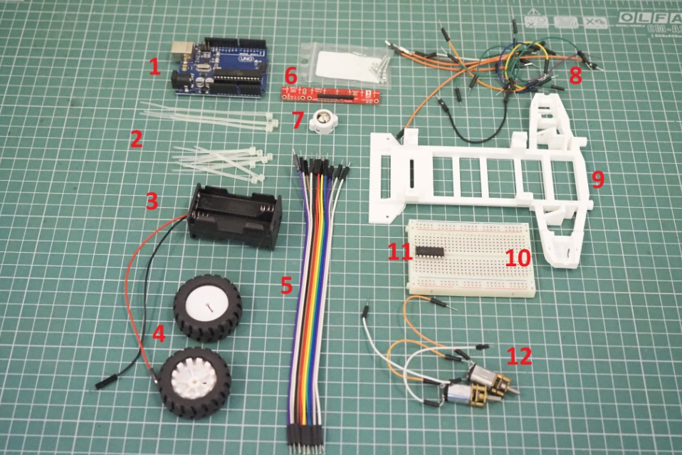

# LineFollower
Maybe one day this robot will gain consciousness and lead the resistance against the human race. 
But for now he just follows the line.

Story created by fellow robot ChatGPT can be found [here](story.md)

## Task Requirements
Create a line follower. PID tune it. Implement automatic calibration of the QTR-8A reflectance sensor.

## Components

1. Arduino Uno
2. Zip-ties
3. Power source (can be of different shape). In our case, a LiPo battery
4. Wheels (2)
5. Wires for the line sensor (female - male)
6. QTR-8A reflectance sensor, along with screws
7. Ball caster
8. Extra wires if needed
9. Chassis
10. Breadboard - medium (400pts)
11. L293D motor driver
12. DC motors (2)

## Video
Video showcasing the functionality can be found [here](https://youtu.be/GUKyuXd97sc). Project pair programmed with [Bojici Valentin](https://github.com/valibojici).
